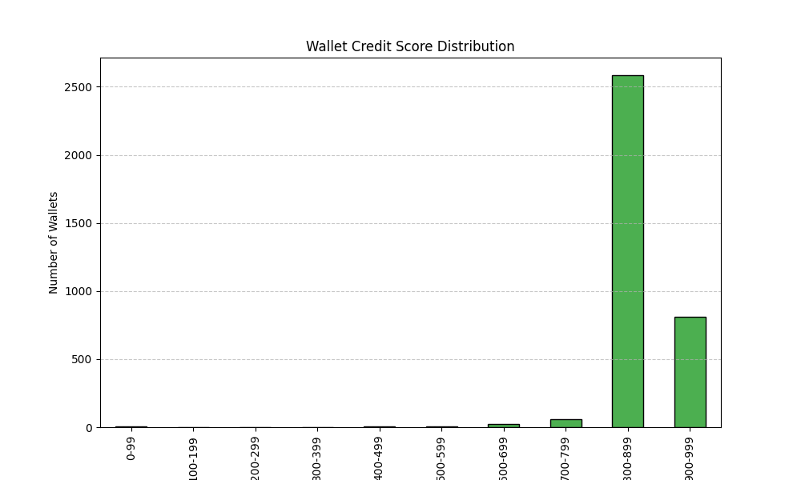

# 📈 Wallet Credit Score Analysis

This document provides a quick analysis of the credit scores assigned to 3,498 Aave V2 wallets based on their historical transaction behavior.

---

## 📊 Score Distribution



---

## 🧮 Score Buckets

## 📊 Score Buckets Summary

| Score Range | Wallet Count | Notes                                                     |
| ----------- | ------------ | --------------------------------------------------------- |
| 0–699       | 27           | Risky, inactive, or incomplete users                      |
| 700–849     | 72           | Moderate DeFi activity, possibly low diversity in actions |
| 850–899     | 2,132        | Healthy behavior, regular deposits and repayments         |
| 900–999     | 625          | High DeFi engagement, reliable and active usage           |
| 1000        | 637          | Top-performing wallets with near-perfect behavior         |

> Replace `X`, `Y`, `Z` with actual numbers by grouping in pandas.

```python
import pandas as pd
df = pd.read_csv("wallet_scores.csv")
pd.cut(df['score'], bins=[0, 699, 849, 949, 1000]).value_counts()